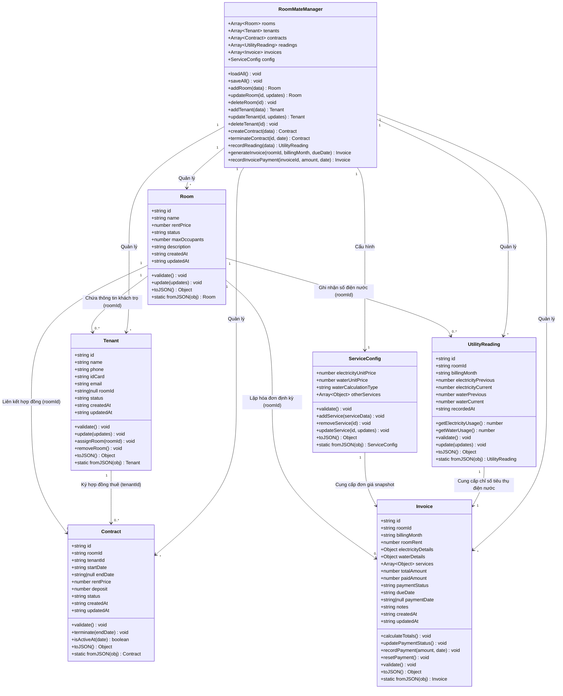

# Tài Liệu Thiết Thiết Kế Mô Hình Dữ Liệu JavaScript - Dự Án RoomMate

Tài liệu này trình bày chi tiết về kiến trúc mô hình dữ liệu (Data Model) của dự án **RoomMate (Hệ thống quản lý nhà trọ và hóa đơn điện nước)**. Hệ thống được phát triển trên nền tảng JavaScript thuần (ES Modules), sử dụng cơ chế OOP (Object-Oriented Programming) để đóng gói dữ liệu và logic nghiệp vụ, kết hợp với LocalStorage để lưu trữ dữ liệu bền vững.

---

## 1. Sơ Đồ Thực Thể & Mối Quan Hệ (Entity Class Diagram)

Dưới đây là sơ đồ lớp mô tả cấu trúc các thực thể dữ liệu, các thuộc tính, phương thức và mối quan hệ giữa chúng trong hệ thống RoomMate:



---

## 2. Chi Tiết Các Lớp Mô Hình Dữ Liệu (Model Classes)

Hệ thống có 6 thực thể chính được định nghĩa trong thư mục `src/models/`:

### 2.1. Lớp Room (Phòng Trọ)
Quản lý thông tin và trạng thái hoạt động của từng phòng trọ.
* **Tệp mã nguồn**: [Room.js](file:///d:/TESTER_CICD_CP26SCM02/roommate-pms/src/models/Room.js)
* **Các thuộc tính chính**:
  * `id` (`string`): Định danh duy nhất của phòng (tự sinh ngẫu nhiên).
  * `name` (`string`): Tên phòng (ví dụ: "Phòng 101"). Yêu cầu không trùng lặp và không để trống.
  * `rentPrice` (`number`): Giá cho thuê phòng cơ bản (VNĐ/tháng). Giá trị mặc định: `0`.
  * `status` (`string`): Trạng thái phòng, nhận một trong các giá trị của enum `RoomStatus`:
    * `empty`: Phòng trống, sẵn sàng cho thuê. (Mặc định)
    * `rented`: Phòng đã được thuê (đang hoạt động).
    * `maintenance`: Phòng đang sửa chữa/bảo trì.
  * `maxOccupants` (`number`): Số lượng người ở tối đa. Mặc định: `2`.
  * `description` (`string`): Mô tả thêm về phòng (tiện ích, diện tích...).
  * `createdAt` / `updatedAt` (`string`): Thời gian tạo/cập nhật dưới định dạng ISO 8601.
* **Các phương thức nghiệp vụ**:
  * `validate()`: Kiểm tra tính hợp lệ của thuộc tính (tên phòng không rỗng, giá và sức chứa phải lớn hơn hoặc bằng 0, trạng thái phải nằm trong tập hợp hợp lệ).
  * `update(updates)`: Cập nhật các trường thông tin phòng và tự động gọi validate lại.

---

### 2.2. Lớp Tenant (Khách Thuê)
Quản lý thông tin cá nhân và tình trạng thuê phòng của từng người dân.
* **Tệp mã nguồn**: [Tenant.js](file:///d:/TESTER_CICD_CP26SCM02/roommate-pms/src/models/Tenant.js)
* **Các thuộc tính chính**:
  * `id` (`string`): Định danh khách thuê.
  * `name` (`string`): Họ và tên khách thuê. Không được trống.
  * `phone` (`string`): Số điện thoại liên lạc. Định dạng từ 9 đến 12 ký số.
  * `idCard` (`string`): Số CCCD/CMND để đăng ký tạm trú. Yêu cầu đúng 9 hoặc 12 chữ số.
  * `email` (`string`): Địa chỉ thư điện tử (tùy chọn).
  * `roomId` (`string | null`): Định danh phòng trọ mà khách hàng đang ở. Mặc định: `null` (chưa thuê phòng).
  * `status` (`string`): Trạng thái hoạt động (`active` - đang thuê, `inactive` - đã chuyển đi).
* **Các phương thức nghiệp vụ**:
  * `validate()`: Kiểm tra định dạng hợp lệ của số điện thoại, định dạng CCCD/CMND, định dạng Email và các trường bắt buộc khác.
  * `assignRoom(roomId)`: Gán khách thuê vào một phòng và chuyển trạng thái sang `active`.
  * `removeRoom()`: Rút khách thuê khỏi phòng trọ hiện tại và chuyển trạng thái sang `inactive`.

---

### 2.3. Lớp Contract (Hợp Đồng Thuê)
Đại diện cho văn bản thỏa thuận thuê phòng giữa chủ nhà và khách thuê chính (đại diện phòng).
* **Tệp mã nguồn**: [Contract.js](file:///d:/TESTER_CICD_CP26SCM02/roommate-pms/src/models/Contract.js)
* **Các thuộc tính chính**:
  * `id` (`string`): Định danh hợp đồng.
  * `roomId` (`string`): ID phòng trọ thuê.
  * `tenantId` (`string`): ID của khách thuê chính ký hợp đồng.
  * `startDate` (`string`): Ngày bắt đầu thuê (định dạng `YYYY-MM-DD`).
  * `endDate` (`string | null`): Ngày hết hạn hợp đồng hoặc kết thúc dự kiến (định dạng `YYYY-MM-DD`).
  * `rentPrice` (`number`): Giá thuê thực tế thống nhất trong hợp đồng.
  * `deposit` (`number`): Tiền đặt cọc của khách thuê. Mặc định: `0`.
  * `status` (`string`): Trạng thái hợp đồng (`active` - đang hiệu lực, `terminated` - chấm dứt trước hạn, `expired` - hết hạn tự nhiên).
* **Các phương thức nghiệp vụ**:
  * `validate()`: Đảm bảo ngày bắt đầu và kết thúc là ngày hợp lệ, ngày kết thúc phải sau ngày bắt đầu, giá thuê và cọc phải là số không âm.
  * `terminate(endDate)`: Chấm dứt hợp đồng sớm tại ngày chỉ định và đổi trạng thái thành `terminated`.
  * `isActiveAt(date)`: Kiểm tra xem tại một thời điểm (ngày kiểm tra) hợp đồng có đang hoạt động hay không.

---

### 2.4. Lớp UtilityReading (Ghi Số Điện Nước)
Lưu trữ chỉ số công tơ điện và nước của từng phòng theo từng kỳ tháng hóa đơn.
* **Tệp mã nguồn**: [UtilityReading.js](file:///d:/TESTER_CICD_CP26SCM02/roommate-pms/src/models/UtilityReading.js)
* **Các thuộc tính chính**:
  * `id` (`string`): Định danh bản ghi ghi số.
  * `roomId` (`string`): ID phòng trọ.
  * `billingMonth` (`string`): Tháng tính tiền (định dạng định kỳ `YYYY-MM`, ví dụ: "2026-07").
  * `electricityPrevious` (`number`): Chỉ số điện kỳ trước.
  * `electricityCurrent` (`number`): Chỉ số điện kỳ này.
  * `waterPrevious` (`number`): Chỉ số nước kỳ trước.
  * `waterCurrent` (`number`): Chỉ số nước kỳ này.
  * `recordedAt` (`string`): Ngày ghi nhận dữ liệu số điện nước.
* **Các phương thức nghiệp vụ**:
  * `getElectricityUsage()`: Tính lượng điện tiêu thụ (`electricityCurrent - electricityPrevious`), chặn dưới bằng `0`.
  * `getWaterUsage()`: Tính lượng nước tiêu thụ (`waterCurrent - waterPrevious`), chặn dưới bằng `0`.
  * `validate()`: Đảm bảo chỉ số mới phải lớn hơn hoặc bằng chỉ số cũ và tháng tính tiền tuân thủ định dạng `YYYY-MM`.

---

### 2.5. Lớp ServiceConfig (Cấu Hình Đơn Giá Dịch Vụ)
Lưu trữ thông tin bảng giá dịch vụ áp dụng chung cho toàn nhà trọ.
* **Tệp mã nguồn**: [ServiceConfig.js](file:///d:/TESTER_CICD_CP26SCM02/roommate-pms/src/models/ServiceConfig.js)
* **Các thuộc tính chính**:
  * `electricityUnitPrice` (`number`): Đơn giá điện (Ví dụ: `3500` VNĐ/kWh).
  * `waterUnitPrice` (`number`): Đơn giá nước (Ví dụ: `20000` VNĐ/m³ hoặc `100000` VNĐ/người).
  * `waterCalculationType` (`string`): Cách tính tiền nước (`per_cubic` - tính theo khối hoặc `per_person` - tính theo đầu người).
  * `otherServices` (`Array<Object>`): Danh sách dịch vụ đi kèm khác (WiFi, rác, xe máy, vệ sinh, giữ xe...), mỗi dịch vụ có:
    * `id` (`string`): Định danh dịch vụ.
    * `name` (`string`): Tên dịch vụ.
    * `price` (`number`): Đơn giá dịch vụ.
    * `type` (`string`): Loại áp dụng: `flat` (cố định theo phòng), `per_person` (thu theo đầu người), `per_room` (thu theo phòng).
* **Các phương thức nghiệp vụ**:
  * `addService(serviceData)`: Thêm một dịch vụ phát sinh mới vào cấu hình.
  * `removeService(id)`: Loại bỏ dịch vụ theo ID.
  * `updateService(id, updates)`: Cập nhật thông tin đơn giá hoặc phương thức tính của dịch vụ.

---

### 2.6. Lớp Invoice (Hóa Đơn Thanh Toán)
Thực thể tổng hợp mọi khoản thu chi trong tháng của một phòng trọ, tự động tính toán tổng số tiền dựa trên dữ liệu chỉ số điện nước và cấu hình đơn giá.
* **Tệp mã nguồn**: [Invoice.js](file:///d:/TESTER_CICD_CP26SCM02/roommate-pms/src/models/Invoice.js)
* **Các thuộc tính chính**:
  * `id` (`string`): Định danh hóa đơn.
  * `roomId` (`string`): ID phòng trọ được tính tiền.
  * `billingMonth` (`string`): Tháng tính tiền (`YYYY-MM`).
  * `roomRent` (`number`): Tiền phòng tháng đó (lấy snapshot từ hợp đồng).
  * `electricityDetails` (`Object`): Chi tiết tiền điện tiêu thụ (lưu lại chỉ số cũ, mới, lượng tiêu thụ, đơn giá, tổng tiền điện).
  * `waterDetails` (`Object`): Chi tiết tiền nước tiêu thụ (lưu lại chỉ số cũ, mới hoặc số người ở, loại tính tiền, đơn giá, tổng tiền nước).
  * `services` (`Array<Object>`): Snapshot danh sách dịch vụ đi kèm đã dùng và chi phí thực tế.
  * `totalAmount` (`number`): Tổng số tiền hóa đơn cần thanh toán.
  * `paidAmount` (`number`): Số tiền khách trọ thực tế đã trả.
  * `paymentStatus` (`string`): Trạng thái đóng tiền, nhận một trong:
    * `unpaid`: Chưa đóng tiền (Mặc định).
    * `partially_paid`: Đã thanh toán một phần.
    * `paid`: Đã thanh toán đủ.
  * `dueDate` (`string`): Hạn cuối đóng tiền (mặc định là 7 ngày kể từ ngày xuất hóa đơn).
  * `paymentDate` (`string | null`): Ngày đóng đủ tiền.
  * `notes` (`string`): Ghi chú phát sinh của hóa đơn.
* **Các phương thức nghiệp vụ**:
  * `calculateTotals()`: Thực hiện công thức tính tổng số tiền tự động:
    $$\text{totalAmount} = \text{roomRent} + (\text{electricityUsage} \times \text{electricityUnitPrice}) + \text{waterCost} + \sum (\text{servicePrice} \times \text{serviceQuantity})$$
    Đồng thời cập nhật trạng thái thanh toán tương ứng dựa trên `paidAmount`.
  * `recordPayment(amount, date)`: Ghi nhận lượt trả tiền từ khách trọ. Cho phép trả làm nhiều đợt (cộng dồn vào `paidAmount`).
  * `resetPayment()`: Thiết lập lại trạng thái hóa đơn về chưa thanh toán.

---

## 3. Quản Lý Luồng Dữ Liệu & Đồng Bộ Lưu Trữ (State & Storage Orchestration)

Toàn bộ các thực thể lớp ở trên được quản lý tập trung thông qua lớp điều phối dịch vụ **`RoomMateManager`** ([RoomMateManager.js](file:///d:/TESTER_CICD_CP26SCM02/roommate-pms/src/services/RoomMateManager.js)).

### 3.1. Dịch Vụ Lưu Trữ Bền Vững (StorageService)
`StorageService` ([StorageService.js](file:///d:/TESTER_CICD_CP26SCM02/roommate-pms/src/services/StorageService.js)) đảm nhận vai trò cầu nối với bộ nhớ:
* **Môi trường Trình duyệt (Browser)**: Tương tác trực tiếp với API `window.localStorage`.
* **Môi trường Kiểm thử (Vitest/NodeJS)**: Tự động phát hiện và chuyển sang cơ chế lưu trữ ảo trong bộ nhớ RAM (`MemoryStorage`) để tránh gây lỗi không tồn tại đối tượng toàn cục `window`.
* **Serialization / Deserialization**:
  * Khi lưu: Dữ liệu được chuyển đổi sang chuỗi JSON bằng phương thức `.toJSON()` của các thực thể.
  * Khi tải: Chuỗi JSON được phân tích và khôi phục thành các thực thể lớp tương ứng thông qua hàm tĩnh `fromJSON(obj)`.

### 3.2. Cấu Trúc Khóa Lưu Trữ LocalStorage (JSON Schema)
Dữ liệu trong hệ thống RoomMate được chia thành 6 khóa lưu trữ riêng biệt trên LocalStorage:

#### 1. Khóa `roommate_rooms` (Mảng chứa các phòng trọ)
```json
[
  {
    "id": "r-001",
    "name": "P.101",
    "rentPrice": 3000000,
    "status": "rented",
    "maxOccupants": 2,
    "description": "Phòng tầng 1, ban công rộng thoáng",
    "createdAt": "2026-07-15T06:10:00.000Z",
    "updatedAt": "2026-07-15T06:10:00.000Z"
  }
]
```

#### 2. Khóa `roommate_tenants` (Mảng chứa các khách thuê)
```json
[
  {
    "id": "t-001",
    "name": "Nguyễn Văn An",
    "phone": "0901000001",
    "idCard": "079200001001",
    "email": "an.nv@gmail.com",
    "roomId": "r-001",
    "status": "active",
    "createdAt": "2026-07-15T06:10:00.000Z",
    "updatedAt": "2026-07-15T06:10:00.000Z"
  }
]
```

#### 3. Khóa `roommate_contracts` (Mảng chứa các hợp đồng)
```json
[
  {
    "id": "c-001",
    "roomId": "r-001",
    "tenantId": "t-001",
    "startDate": "2026-07-15",
    "endDate": "2027-07-15",
    "rentPrice": 3000000,
    "deposit": 3000000,
    "status": "active",
    "createdAt": "2026-07-15T06:12:00.000Z",
    "updatedAt": "2026-07-15T06:12:00.000Z"
  }
]
```

#### 4. Khóa `roommate_readings` (Mảng ghi điện nước định kỳ)
```json
[
  {
    "id": "u-001",
    "roomId": "r-001",
    "billingMonth": "2026-07",
    "electricityPrevious": 1250,
    "electricityCurrent": 1390,
    "waterPrevious": 63,
    "waterCurrent": 70,
    "recordedAt": "2026-07-15T06:12:30.000Z"
  }
]
```

#### 5. Khóa `roommate_service_config` (Cấu hình giá dịch vụ toàn nhà)
```json
{
  "electricityUnitPrice": 3500,
  "waterUnitPrice": 20000,
  "waterCalculationType": "per_cubic",
  "otherServices": [
    { "id": "s-1", "name": "Internet/WiFi", "price": 100000, "type": "flat" },
    { "id": "s-2", "name": "Vệ sinh hành lang", "price": 30000, "type": "per_room" }
  ]
}
```

#### 6. Khóa `roommate_invoices` (Mảng hóa đơn thanh toán)
```json
[
  {
    "id": "i-001",
    "roomId": "r-001",
    "billingMonth": "2026-07",
    "roomRent": 3000000,
    "electricityDetails": {
      "previous": 1250,
      "current": 1390,
      "usage": 140,
      "unitPrice": 3500,
      "total": 490000
    },
    "waterDetails": {
      "previous": 63,
      "current": 70,
      "calculationType": "per_cubic",
      "occupantsCount": 1,
      "usage": 7,
      "unitPrice": 20000,
      "total": 140000
    },
    "services": [
      { "name": "Internet/WiFi", "price": 100000, "quantity": 1, "type": "flat", "total": 100000 },
      { "name": "Vệ sinh hành lang", "price": 30000, "quantity": 1, "type": "per_room", "total": 30000 }
    ],
    "totalAmount": 3760000,
    "paidAmount": 3760000,
    "paymentStatus": "paid",
    "dueDate": "2026-07-22",
    "paymentDate": "2026-07-15",
    "notes": "Hóa đơn tháng 7 thanh toán qua chuyển khoản ngân hàng",
    "createdAt": "2026-07-15T06:12:45.000Z",
    "updatedAt": "2026-07-15T06:12:50.000Z"
  }
]
```

---

## 4. Luồng Nghiệp Vụ Điển Hình (Workflow & Logic Actions)

### 4.1. Quy Trình Tạo Hợp Đồng & Nhận Phòng
Khi một khách thuê nhận phòng thông qua `RoomMateManager.createContract()`:
1. Xác minh phòng có tồn tại và đang ở trạng thái `empty` hay không.
2. Tạo mới hợp đồng `Contract` với trạng thái `active` và lưu lại.
3. Thay đổi trạng thái phòng trọ sang `rented`.
4. Gọi phương thức `assignRoom(roomId)` trên đối tượng khách thuê đó để liên kết phòng.
5. Đồng bộ lưu trữ xuống LocalStorage.

### 4.2. Quy Trình Xuất Hóa Đơn Cuối Tháng
Khi chủ nhà xuất hóa đơn thông qua `RoomMateManager.generateInvoice(roomId, billingMonth)`:
1. Truy vấn phòng trọ và tìm hợp đồng `Contract` đang hoạt động (`active`) tại tháng thanh toán đó.
2. Truy xuất chỉ số điện nước `UtilityReading` tương ứng với phòng và tháng chỉ định.
3. Đếm số lượng khách thuê thực tế đang ở tại phòng (`getTenantsInRoom(roomId)`).
4. Khởi tạo đối tượng `Invoice` mới chứa toàn bộ dữ liệu snapshot của tiền phòng, chỉ số điện nước, và danh sách dịch vụ từ `ServiceConfig`.
5. Tự động tính toán tổng số tiền bằng `calculateTotals()`.
6. Lưu hóa đơn vào danh sách để quản lý.
