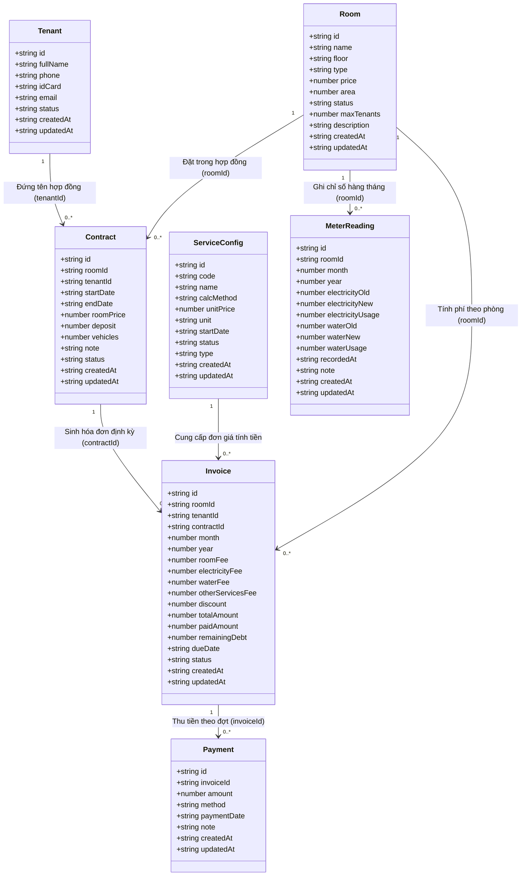

# Tài Liệu Thiết Kế Mô Hình Dữ Liệu JavaScript - Dự Án RoomMate PMS

Tài liệu này trình bày chi tiết về kiến trúc mô hình dữ liệu (Data Model), các dịch vụ quản lý (Services), hàm kiểm tra nghiệp vụ (Validators & Business) và cấu trúc lưu trữ LocalStorage của dự án **RoomMate PMS (Hệ thống quản lý nhà trọ, điện nước và hóa đơn)**.

Hệ thống được thiết kế theo kiến trúc ES Modules sạch (Vanilla JS + Vite), phân chia rõ ràng giữa tầng dữ liệu, tầng xử lý nghiệp vụ (Business Rules), tầng dịch vụ dữ liệu (Services) và giao diện người dùng (UI Components/Pages).

---

## 1. Sơ Đồ Thực Thể & Mối Quan Hệ (Entity Class & Relation Diagram)

Dưới đây là sơ đồ lớp mô tả cấu trúc các thực thể dữ liệu chính, các thuộc tính và mối quan hệ giữa chúng trong hệ thống RoomMate PMS:


```mermaid
classDiagram
    class Room {
        +string id
        +string name
        +string floor
        +string type
        +number price
        +number area
        +string status
        +number maxTenants
        +string description
        +string createdAt
        +string updatedAt
    }

    class Tenant {
        +string id
        +string fullName
        +string phone
        +string idCard
        +string email
        +string status
        +string createdAt
        +string updatedAt
    }

    class Contract {
        +string id
        +string roomId
        +string tenantId
        +string startDate
        +string endDate
        +number roomPrice
        +number deposit
        +number vehicles
        +string note
        +string status
        +string createdAt
        +string updatedAt
    }

    class ServiceConfig {
        +string id
        +string code
        +string name
        +string calcMethod
        +number unitPrice
        +string unit
        +string startDate
        +string status
        +string type
        +string createdAt
        +string updatedAt
    }

    class MeterReading {
        +string id
        +string roomId
        +number month
        +number year
        +number electricityOld
        +number electricityNew
        +number electricityUsage
        +number waterOld
        +number waterNew
        +number waterUsage
        +string recordedAt
        +string note
        +string createdAt
        +string updatedAt
    }

    class Invoice {
        +string id
        +string roomId
        +string tenantId
        +string contractId
        +number month
        +number year
        +number roomFee
        +number electricityFee
        +number waterFee
        +number otherServicesFee
        +number discount
        +number totalAmount
        +number paidAmount
        +number remainingDebt
        +string dueDate
        +string status
        +string createdAt
        +string updatedAt
    }

    class Payment {
        +string id
        +string invoiceId
        +number amount
        +string method
        +string paymentDate
        +string note
        +string createdAt
        +string updatedAt
    }

    %% Relationships
    Room "1" --> "0..*" Contract : Đặt trong hợp đồng (roomId)
    Tenant "1" --> "0..*" Contract : Đứng tên hợp đồng (tenantId)
    Contract "1" --> "0..*" Invoice : Sinh hóa đơn định kỳ (contractId)
    Room "1" --> "0..*" MeterReading : Ghi chỉ số hàng tháng (roomId)
    Room "1" --> "0..*" Invoice : Tính phí theo phòng (roomId)
    Invoice "1" --> "0..*" Payment : Thu tiền theo đợt (invoiceId)
    ServiceConfig "1" --> "0..*" Invoice : Cung cấp đơn giá tính tiền
```

---

## 2. Chi Tiết Các Thực Thể Dữ Liệu (Data Models & Schemas)

Hệ thống có 7 thực thể dữ liệu chính được lưu trữ và quản lý nhất quán:

### 2.1. Room (Phòng Trọ)
Quản lý danh mục phòng trọ, sức chứa và trạng thái sẵn sàng cho thuê.
* **Tệp liên quan**: `src/services/room-service.js`, `src/business/room-validator.js`, `src/business/roomBusiness.js`
* **Thuộc tính**:
  * `id` (`string`): Mã định danh duy nhất của phòng (VD: `P101`, `P202`). Không được trống.
  * `name` (`string`): Tên hiển thị của phòng (VD: `Phòng 101`).
  * `floor` (`string`): Tầng/Khu vực phòng (VD: `Tầng 1`, `Block A`).
  * `type` (`string`): Loại phòng (`standard` - Tiêu chuẩn, `deluxe` - Cao cấp, `suite` - VIP, `dormitory` - Ký túc xá, `studio` - Studio).
  * `price` (`number`): Giá cho thuê niêm yết (VNĐ/tháng). Phải là số `>= 0`.
  * `area` (`number`): Diện tích phòng ($m^2$). Phải là số `> 0`.
  * `status` (`string`): Trạng thái hoạt động (`available` - Trống, `rented` - Đang thuê, `maintenance` - Bảo trì, `out_of_order` - Tạm ngưng).
  * `maxTenants` (`number`): Số người ở tối đa. Phải là số `>= 1`.
  * `description` (`string`): Ghi chú tiện ích phòng.
  * `createdAt` / `updatedAt` (`string`): ISO Timestamp.

---

### 2.2. Tenant (Người Thuê)
Quản lý danh sách thông tin khách thuê trọ.
* **Tệp liên quan**: `src/services/tenant-service.js`, `src/business/tenant-validator.js`, `src/business/tenantBusiness.js`
* **Thuộc tính**:
  * `id` (`string`): Mã định danh khách thuê (VD: `t-001`).
  * `fullName` (`string`): Họ và tên đầy đủ. Không được trống.
  * `phone` (`string`): Số điện thoại liên lạc (bắt buộc 10-11 chữ số).
  * `idCard` (`string`): Số CCCD/CMND (9 hoặc 12 chữ số).
  * `email` (`string`): Địa chỉ email liên hệ (tùy chọn, đúng định dạng).
  * `status` (`string`): Trạng thái (`active` - Đang thuê, `inactive` - Đã rời, `suspended` - Tạm ngưng, `archived` - Đã lưu trữ).
  * `createdAt` / `updatedAt` (`string`): ISO Timestamp.

---

### 2.3. Contract (Hợp Đồng Thuê)
Ràng buộc pháp lý thuê phòng giữa chủ nhà và đại diện người thuê.
* **Tệp liên quan**: `src/services/contract-service.js`, `src/business/contract-validator.js`, `src/business/contract-utils.js`
* **Thuộc tính**:
  * `id` (`string`): Mã hợp đồng (VD: `c-001`, `C-202607-P101`).
  * `roomId` (`string`): ID phòng trọ thuê.
  * `tenantId` (`string`): ID của khách đại diện đứng tên hợp đồng.
  * `startDate` (`string`): Ngày bắt đầu hiệu lực (`YYYY-MM-DD`).
  * `endDate` (`string`): Ngày kết thúc hợp đồng (`YYYY-MM-DD`). Ngày kết thúc phải sau ngày bắt đầu.
  * `roomPrice` (`number`): Giá thuê thỏa thuận (VNĐ/tháng).
  * `deposit` (`number`): Tiền đặt cọc giữ phòng (VNĐ).
  * `vehicles` (`number`): Số lượng xe đăng ký (mặc định `0`).
  * `note` (`string`): Điều khoản bổ sung.
  * `status` (`string`): Trạng thái (`draft` - Nháp, `pending` - Chờ hiệu lực, `active` - Hiệu lực, `expiring_soon` - Sắp hết hạn, `expired` - Hết hạn, `terminated` - Đã thanh lý, `cancelled` - Đã hủy).
  * `createdAt` / `updatedAt` (`string`): ISO Timestamp.

---

### 2.4. ServiceConfig (Cấu Hình Dịch Vụ)
Danh mục đơn giá các dịch vụ điện, nước, internet, rác, gửi xe...
* **Tệp liên quan**: `src/services/service-config-service.js`, `src/business/service-config-validator.js`
* **Thuộc tính**:
  * `id` (`string`): Mã định danh cấu hình (VD: `svc-dien`, `svc-nuoc`).
  * `code` (`string`): Mã ngắn dịch vụ (`DIEN`, `NUOC`, `WIFI`, `RAC`, `GIAT`...).
  * `name` (`string`): Tên dịch vụ (VD: `Điện tiêu thụ`, `Nước sinh hoạt`).
  * `calcMethod` (`string`): Cách tính phí (`usage` - Theo lượng dùng, `perPerson` - Theo số người, `fixed` / `flat` - Cố định phòng, `perRoom` - Theo phòng).
  * `unitPrice` (`number`): Đơn giá dịch vụ (VNĐ). Phải là số `>= 0`.
  * `unit` (`string`): Đơn vị tính (`kWh`, `m3`, `người`, `tháng`, `phòng`, `lần`).
  * `startDate` (`string`): Ngày bắt đầu áp dụng đơn giá.
  * `status` (`string`): Trạng thái áp dụng (`active` - Đang áp dụng, `inactive` - Ngưng áp dụng).
  * `type` (`string`): Phân loại (`electricity`, `water`, `other`).

---

### 2.5. MeterReading (Chỉ Số Điện Nước)
Bản ghi số công tơ điện và nước hàng tháng của từng phòng.
* **Tệp liên quan**: `src/services/meter-reading-service.js`, `src/business/meter-validator.js`, `src/business/meter-calculator.js`
* **Thuộc tính**:
  * `id` (`string`): Mã chỉ số (VD: `m-P101-2026-07`).
  * `roomId` (`string`): ID phòng trọ.
  * `month` (`number`): Tháng ghi số (1-12).
  * `year` (`number`): Năm ghi số (VD: `2026`).
  * `electricityOld` (`number`): Chỉ số điện cũ (không âm).
  * `electricityNew` (`number`): Chỉ số điện mới (không âm, `>= electricityOld`).
  * `electricityUsage` (`number`): Điện tiêu thụ trong tháng (`electricityNew - electricityOld`).
  * `waterOld` (`number`): Chỉ số nước cũ (không âm).
  * `waterNew` (`number`): Chỉ số nước mới (không âm, `>= waterOld`).
  * `waterUsage` (`number`): Nước tiêu thụ trong tháng (`waterNew - waterOld`).
  * `recordedAt` (`string`): Ngày ghi số (`YYYY-MM-DD`).
  * `note` (`string`): Ghi chú bất thường (nếu có).

---

### 2.6. Invoice (Hóa Đơn Thanh Toán)
Thực thể tổng hợp toàn bộ tiền phòng, tiền điện, nước và các dịch vụ trong tháng.
* **Tệp liên quan**: `src/services/invoice-service.js`, `src/business/invoice-validator.js`, `src/business/invoice-calculator.js`
* **Thuộc tính**:
  * `id` (`string`): Mã hóa đơn (VD: `INV-202607-P101`).
  * `roomId` (`string`): ID phòng trọ.
  * `tenantId` (`string`): ID người thuê đại diện.
  * `contractId` (`string`): ID hợp đồng áp dụng.
  * `month` / `year` (`number`): Tháng/Năm tính hóa đơn.
  * `roomFee` (`number`): Tiền thuê phòng trong tháng (VNĐ).
  * `electricityFee` (`number`): Tiền điện tiêu thụ ($\text{lượng dùng} \times \text{đơn giá}$).
  * `waterFee` (`number`): Tiền nước tiêu thụ.
  * `otherServicesFee` (`number`): Tổng tiền dịch vụ cộng thêm (WiFi, rác, gửi xe...).
  * `discount` (`number`): Số tiền giảm giá/khuyến mãi (VNĐ).
  * `totalAmount` (`number`): Tổng tiền cần thanh toán ($\text{roomFee} + \text{elec} + \text{water} + \text{services} - \text{discount}$).
  * `paidAmount` (`number`): Số tiền thực tế khách đã thanh toán dồn tích.
  * `remainingDebt` (`number`): Số tiền còn nợ ($\text{totalAmount} - \text{paidAmount}$).
  * `dueDate` (`string`): Hạn chót thanh toán (`YYYY-MM-DD`).
  * `status` (`string`): Trạng thái (`draft` - Nháp, `unpaid` - Chưa thanh toán, `partial` - Thanh toán một phần, `paid` - Đã thanh toán đủ, `cancelled` - Đã hủy).

---

### 2.7. Payment (Nhật Ký Thanh Toán)
Ghi nhận từng lượt nộp tiền của khách thuê cho một hóa đơn cụ thể.
* **Tệp liên quan**: `src/services/payment-service.js`, `src/business/payment-validator.js`, `src/business/payment-processor.js`
* **Thuộc tính**:
  * `id` (`string`): Mã phiếu thu (VD: `pay-001`).
  * `invoiceId` (`string`): Mã hóa đơn được thanh toán.
  * `amount` (`number`): Số tiền nộp trong đợt này (VNĐ). Phải là số `> 0`.
  * `method` (`string`): Phương thức thanh toán (`cash` - Tiền mặt, `transfer` - Chuyển khoản, `e_wallet` - Ví điện tử, `other` - Khác).
  * `paymentDate` (`string`): Ngày thu tiền (`YYYY-MM-DD`).
  * `note` (`string`): Ghi chú giao dịch (VD: "Chuyển khoản VCB qua QR code").

---

## 3. Tầng Quản Lý Lưu Trữ Bền Vững (Storage Layer Schema)

Mọi dữ liệu của RoomMate PMS được lưu trữ tập trung tại **LocalStorage** thông qua dịch vụ [storage-service.js](file:///d:/TESTER_CICD_CP26SCM02/roommate-pms/src/services/storage-service.js).

### 3.1. Danh Sách Các Khóa Lưu Trữ (Keys)
| Key Name | Mô Tả | Kiểu Dữ Liệu |
| :--- | :--- | :--- |
| `rooms` | Danh sách tất cả phòng trọ | `Array<RoomObject>` |
| `tenants` | Danh sách người thuê | `Array<TenantObject>` |
| `contracts` | Danh sách hợp đồng thuê | `Array<ContractObject>` |
| `serviceConfigs` | Cấu hình đơn giá dịch vụ | `Array<ServiceConfigObject>` |
| `meter_readings` | Nhật ký chỉ số điện nước hàng tháng | `Array<MeterReadingObject>` |
| `invoices` | Danh sách hóa đơn | `Array<InvoiceObject>` |
| `payments` | Nhật ký phiếu thu thanh toán | `Array<PaymentObject>` |

### 3.2. Cấu Trúc JSON Mẫu (Sample LocalStorage Records)

```json
{
  "rooms": [
    {
      "id": "P101",
      "name": "Phòng 101",
      "floor": "Tầng 1",
      "type": "standard",
      "price": 3000000,
      "area": 25,
      "status": "rented",
      "maxTenants": 3,
      "description": "Có điều hòa, tủ lạnh, ban công",
      "createdAt": "2026-07-01T00:00:00.000Z",
      "updatedAt": "2026-07-01T00:00:00.000Z"
    }
  ],
  "tenants": [
    {
      "id": "t-001",
      "fullName": "Nguyễn Văn An",
      "phone": "0901234567",
      "idCard": "079200001001",
      "email": "an.nguyen@gmail.com",
      "status": "active",
      "createdAt": "2026-07-01T00:00:00.000Z",
      "updatedAt": "2026-07-01T00:00:00.000Z"
    }
  ],
  "contracts": [
    {
      "id": "c-001",
      "roomId": "P101",
      "tenantId": "t-001",
      "startDate": "2026-07-01",
      "endDate": "2027-07-01",
      "roomPrice": 3000000,
      "deposit": 3000000,
      "vehicles": 1,
      "note": "Hợp đồng 12 tháng",
      "status": "active",
      "createdAt": "2026-07-01T00:00:00.000Z",
      "updatedAt": "2026-07-01T00:00:00.000Z"
    }
  ],
  "meter_readings": [
    {
      "id": "m-P101-2026-07",
      "roomId": "P101",
      "month": 7,
      "year": 2026,
      "electricityOld": 100,
      "electricityNew": 180,
      "electricityUsage": 80,
      "waterOld": 10,
      "waterNew": 18,
      "waterUsage": 8,
      "recordedAt": "2026-07-25",
      "note": ""
    }
  ],
  "invoices": [
    {
      "id": "INV-202607-P101",
      "roomId": "P101",
      "tenantId": "t-001",
      "contractId": "c-001",
      "month": 7,
      "year": 2026,
      "roomFee": 3000000,
      "electricityFee": 240000,
      "waterFee": 120000,
      "otherServicesFee": 50000,
      "discount": 0,
      "totalAmount": 3410000,
      "paidAmount": 3410000,
      "remainingDebt": 0,
      "dueDate": "2026-08-05",
      "status": "paid",
      "createdAt": "2026-07-25T00:00:00.000Z",
      "updatedAt": "2026-07-25T00:00:00.000Z"
    }
  ]
}
```

---

## 4. Các Quy Tắc Kiểm Trả Nghiệp Vụ (Business Validation Rules)

1. **Ràng buộc phòng trọ (`room-validator.js`)**:
   - `id` không được trùng lặp.
   - `price >= 0`, `area > 0`, `maxTenants >= 1`.
2. **Ràng buộc người thuê (`tenant-validator.js`)**:
   - `phone` phải có 10-11 chữ số.
   - `idCard` phải có 9 hoặc 12 chữ số.
3. **Ràng buộc hợp đồng (`contract-validator.js`)**:
   - Không cho phép tạo hợp đồng mới trùng thời gian trên cùng 1 phòng đang có hợp đồng hiệu lực.
   - `endDate` phải lớn hơn `startDate`.
4. **Ràng buộc điện nước (`meter-validator.js`)**:
   - `electricityNew >= electricityOld` và không được mang giá trị âm (`< 0`).
   - `waterNew >= waterOld` và không được mang giá trị âm (`< 0`).
5. **Ràng buộc hóa đơn & thanh toán (`payment-validator.js`)**:
   - Số tiền thanh toán mỗi lần không được vượt quá số tiền nợ còn lại (`remainingDebt`).
