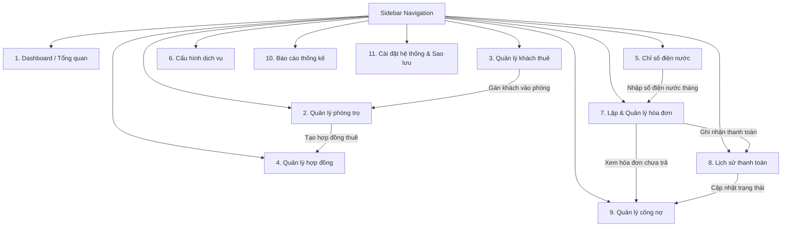

# Tài Liệu Thiết Kế Danh Sách Màn Hình - Dự Án RoomMate

Tài liệu này mô tả chi tiết thiết kế danh sách các màn hình (UI Screens) trong hệ thống **RoomMate (Hệ thống quản lý nhà trọ và hóa đơn điện nước)**. Các màn hình được thiết kế dựa trên cấu trúc Single Page Application (SPA), sử dụng History API để điều hướng sạch và đồng bộ dữ liệu thông qua `RoomMateManager` với LocalStorage.

---

## 1. Sơ Đồ Điều Hướng & Luồng Người Dùng (Navigation Flow)

Dưới đây là sơ đồ mô tả cách người dùng điều hướng qua các màn hình từ menu chính (Sidebar):

---

## 2. Chi Tiết Thiết Kế Từng Màn Hình (Screen Specifications)

---

### 2.1. Màn Hình Dashboard (Tổng Quan Hệ Thống)
*   **Đường dẫn (Route)**: `/dashboard`
*   **Mục đích**: Cung cấp cho chủ nhà trọ cái nhìn tổng thể về tình hình hoạt động của nhà trọ (phòng trống, doanh thu, công nợ, công việc cần xử lý ngay).
*   **Các chức năng chính**:
    *   **Thống kê nhanh (KPI Cards)**:
        *   Tổng số phòng trọ (Tổng / Đang thuê / Trống / Bảo trì).
        *   Tổng số người đang thuê trọ hiện tại.
        *   Doanh thu dự kiến thu trong tháng hiện tại.
        *   Tổng số tiền thực tế đã thu & Số tiền còn nợ (công nợ).
    *   **Cảnh báo cần xử lý gấp (Action Items)**:
        *   Danh sách hóa đơn quá hạn chưa thanh toán.
        *   Danh sách hợp đồng sắp hết hạn (trong vòng 30 ngày).
        *   Phòng trống lâu ngày chưa có người thuê.
    *   **Biểu đồ trực quan**:
        *   Tỷ lệ lấp đầy phòng (Occupancy Rate).
        *   Xu hướng doanh thu thực tế vs công nợ trong 6 tháng qua.
*   **Mô tả giao diện (UI layout)**:
    *   **Hàng 1**: Grid 4 cột chứa các thẻ chỉ số (Cards) với màu sắc chủ đạo riêng biệt (Thanh toán: Xanh lá, Nợ: Đỏ, Phòng trống: Xanh dương, Người thuê: Tím).
    *   **Hàng 2**: Cột trái (60%): Biểu đồ cột thể hiện xu hướng doanh thu. Cột phải (40%): Danh sách các cảnh báo gấp (Alerts widget).
    *   **Hàng 3**: Danh sách 5 hóa đơn được tạo/cập nhật gần đây nhất kèm trạng thái thanh toán.
*   **Liên kết dữ liệu (Data Interaction)**:
    *   Đọc và tính toán từ `RoomMateManager.rooms`, `RoomMateManager.tenants`, `RoomMateManager.contracts`, và `RoomMateManager.invoices`.

---

### 2.2. Màn Hình Quản Lý Phòng Trọ (Room Management)
*   **Đường dẫn (Route)**: `/rooms`
*   **Mục đích**: Quản lý danh sách phòng, thêm mới, sửa chữa thông tin phòng trọ và theo dõi trạng thái sử dụng của từng phòng.
*   **Các chức năng chính**:
    *   **Hiển thị danh sách**: Hỗ trợ hiển thị dạng lưới (Grid/Cards) trực quan hoặc dạng bảng (Table).
    *   **Tìm kiếm & Bộ lọc**: Tìm phòng theo tên, lọc phòng theo trạng thái (`empty` - Trống, `rented` - Đang thuê, `maintenance` - Bảo trì).
    *   **Thêm phòng mới (Modal)**: Nhập tên phòng, giá thuê mặc định, số lượng người ở tối đa, mô tả tiện ích đi kèm.
    *   **Chỉnh sửa phòng (Modal)**: Cho phép sửa thông tin chi tiết và cập nhật trạng thái phòng.
    *   **Xóa phòng**: Chỉ cho phép xóa khi phòng ở trạng thái trống (`empty`) và không có hợp đồng/hóa đơn nào đang hoạt động liên quan.
    *   **Xem chi tiết phòng (Drawer/Modal)**: Hiển thị thông tin khách đang ở, lịch sử hợp đồng và danh sách hóa đơn của phòng đó.
*   **Mô tả giao diện (UI layout)**:
    *   **Thanh công cụ**: Ô tìm kiếm, Dropdown lọc trạng thái, nút "Thêm phòng" ở góc phải.
    *   **Vùng danh sách**: Các thẻ phòng (Room Cards). Mỗi Card hiển thị: Tên phòng lớn, Badge trạng thái (xanh lá: Đang thuê, xám: Trống, cam: Bảo trì), Giá thuê cơ bản, Sức chứa thực tế (ví dụ: "2/3 người"), các icon tiện ích nhanh và nút hành động (Xem, Sửa, Xóa).
*   **Liên kết dữ liệu (Data Interaction)**:
    *   Gọi các hàm `RoomMateManager.addRoom()`, `updateRoom()`, `deleteRoom()`.
    *   Liên kết dữ liệu với lớp `Room` ([Room.js](file:///d:/TESTER_CICD_CP26SCM02/roommate-pms/src/models/Room.js)).

---

### 2.3. Màn Hình Quản Lý Khách Thuê (Tenant Management)
*   **Đường dẫn (Route)**: `/tenants`
*   **Mục đích**: Quản lý hồ sơ thông tin cá nhân của tất cả khách thuê trọ trong hệ thống.
*   **Các chức năng chính**:
    *   **Tìm kiếm & Bộ lọc**: Tìm theo Tên, Số điện thoại hoặc CCCD. Lọc khách đang ở (`active`) hoặc đã chuyển đi (`inactive`).
    *   **Thêm khách thuê mới (Modal)**: Nhập Họ tên, Số điện thoại (9-12 số), Số CCCD (9 hoặc 12 số), Email (tùy chọn), và chọn phòng trọ để gán vào (nếu có phòng trống).
    *   **Chỉnh sửa thông tin (Modal)**: Cập nhật thông tin liên lạc, hồ sơ cá nhân.
    *   **Gán phòng/Rút phòng nhanh**: Thay đổi phòng trọ cho khách thuê hoặc rút khách ra khỏi phòng hiện tại (chuyển sang trạng thái `inactive`).
    *   **Xóa khách thuê**: Xóa hồ sơ khách thuê khỏi cơ sở dữ liệu nếu khách thuê này không nằm trong hợp đồng nào đang có hiệu lực.
*   **Mô tả giao diện (UI layout)**:
    *   **Thanh công cụ**: Tìm kiếm, lọc theo trạng thái, nút "Thêm khách thuê".
    *   **Bảng dữ liệu (Table)**: Cột Họ tên, Số điện thoại, CCCD, Email, Phòng hiện tại (Clickable link để nhảy tới chi tiết phòng), Trạng thái (Badge màu xanh: Active, màu xám: Inactive), và Cột Thao tác (Sửa, Rút phòng, Xóa).
*   **Liên kết dữ liệu (Data Interaction)**:
    *   Gọi các hàm `RoomMateManager.addTenant()`, `updateTenant()`, `deleteTenant()`.
    *   Liên kết dữ liệu với lớp `Tenant` ([Tenant.js](file:///d:/TESTER_CICD_CP26SCM02/roommate-pms/src/models/Tenant.js)).

---

### 2.4. Màn Hình Quản Lý Hợp Đồng (Contract Management)
*   **Đường dẫn (Route)**: `/contracts`
*   **Mục đích**: Quản lý các giao dịch pháp lý giữa chủ nhà và khách thuê đại diện, xác lập giá thuê thực tế, tiền đặt cọc và thời hạn thuê.
*   **Các chức năng chính**:
    *   **Danh sách hợp đồng**: Hiển thị tất cả các hợp đồng, lọc theo trạng thái (`active` - Đang hiệu lực, `terminated` - Thanh lý trước hạn, `expired` - Hết hạn).
    *   **Tạo hợp đồng mới (Form/Modal)**:
        *   Chọn phòng (chỉ danh sách phòng trống).
        *   Chọn khách thuê chính (đại diện hợp đồng).
        *   Nhập Ngày bắt đầu thuê, Ngày kết thúc dự kiến.
        *   Nhập Giá thuê thực tế (mặc định lấy giá thuê của phòng nhưng cho phép chỉnh sửa).
        *   Nhập Tiền đặt cọc.
        *   *Nghiệp vụ kèm theo*: Khi hợp đồng được lưu, phòng tự động đổi trạng thái sang `rented` và khách thuê chính được gán `roomId`.
    *   **Thanh lý hợp đồng (Modal)**: Chọn ngày kết thúc thực tế, ghi chú thanh lý, tự động giải phóng phòng về `empty` và khách thuê về `inactive` (hoặc giữ lại tùy cấu hình).
    *   **Xem/In hợp đồng**: Hiển thị mẫu hợp đồng tóm tắt, có nút hỗ trợ xuất bản in nhanh.
*   **Mô tả giao diện (UI layout)**:
    *   Bảng dữ liệu chứa: Mã hợp đồng, Tên phòng, Khách đại diện, Giá thuê, Tiền cọc, Thời hạn (Từ ngày - Đến ngày), Trạng thái (Badge: Active - xanh lá, Terminated - đỏ, Expired - cam).
    *   Hành động: Nút "Xem chi tiết" (mở bản hợp đồng đầy đủ), nút "Thanh lý hợp đồng" (hiển thị khi trạng thái hợp đồng là `active`).
*   **Liên kết dữ liệu (Data Interaction)**:
    *   Gọi các hàm `RoomMateManager.createContract()`, `terminateContract()`.
    *   Liên kết dữ liệu với lớp `Contract` ([Contract.js](file:///d:/TESTER_CICD_CP26SCM02/roommate-pms/src/models/Contract.js)).

---

### 2.5. Màn Hình Ghi Chỉ Số Điện Nước (Utility Readings / Meters)
*   **Đường dẫn (Route)**: `/meters`
*   **Mục đích**: Ghi nhận chỉ số công tơ điện và nước định kỳ hàng tháng cho từng phòng để làm cơ sở tính tiền dịch vụ.
*   **Các chức năng chính**:
    *   **Bộ lọc kỳ hóa đơn**: Chọn Tháng/Năm tính phí (`YYYY-MM`).
    *   **Bảng nhập số liệu hàng loạt (Batch input)**: Hiển thị danh sách tất cả các phòng đang có khách ở (`rented`).
    *   **Tự động hiển thị số cũ**: Hiển thị chỉ số Điện & Nước cuối kỳ trước (lấy từ dữ liệu của tháng `month - 1`).
    *   **Nhập số mới & Tự động tính lượng tiêu thụ**: Khi người dùng gõ chỉ số Điện mới hoặc Nước mới, hệ thống lập tức tính và hiển thị lượng chênh lệch tiêu thụ ngay trên màn hình.
    *   **Ràng buộc nghiệp vụ (Validation)**: Chỉ số mới nhập vào bắt buộc phải lớn hơn hoặc bằng chỉ số cũ. Nếu nhỏ hơn, hệ thống hiển thị viền đỏ cảnh báo lỗi và không cho phép lưu.
*   **Mô tả giao diện (UI layout)**:
    *   **Header**: Dropdown chọn tháng ghi nhận số (ví dụ: Tháng 07/2026).
    *   **Bảng nhập liệu**: Cột Phòng, Chỉ số điện cũ, Chỉ số điện mới (ô Input số), Điện tiêu thụ (Hiển thị text tự động tính), Chỉ số nước cũ, Chỉ số nước mới (ô Input số), Nước tiêu thụ (Hiển thị text tự động tính), Ngày ghi nhận, Nút hành động "Lưu" từng dòng hoặc nút "Lưu tất cả" ở chân trang.
*   **Liên kết dữ liệu (Data Interaction)**:
    *   Gọi hàm `RoomMateManager.recordReading()`.
    *   Liên kết dữ liệu với lớp `UtilityReading` ([UtilityReading.js](file:///d:/TESTER_CICD_CP26SCM02/roommate-pms/src/models/UtilityReading.js)).

---

### 2.6. Màn Hình Cấu Hình Dịch Vụ (Service Configuration)
*   **Đường dẫn (Route)**: `/services`
*   **Mục đích**: Thiết lập bảng giá điện, nước áp dụng chung và các phí dịch vụ tùy chọn khác của nhà trọ.
*   **Các chức năng chính**:
    *   **Cấu hình Điện**: Cập nhật đơn giá điện trên mỗi kWh.
    *   **Cấu hình Nước**: Cập nhật đơn giá nước và lựa chọn hình thức tính phí:
        *   `per_cubic`: Tính tiền nước theo số khối tiêu thụ thực tế.
        *   `per_person`: Tính tiền nước cố định theo đầu người đang ở trong phòng.
    *   **Quản lý danh sách dịch vụ khác (Wifi, Rác, Gửi xe, Vệ sinh...)**:
        *   Thêm dịch vụ: Nhập tên dịch vụ, đơn giá, và cách thức áp dụng (`flat` - cố định theo phòng, `per_person` - thu theo đầu người, `per_room` - thu theo phòng sử dụng).
        *   Chỉnh sửa đơn giá/tên dịch vụ.
        *   Xóa dịch vụ không còn sử dụng.
*   **Mô tả giao diện (UI layout)**:
    *   Giao diện chia làm 2 Tabs hoặc 2 phân khu lớn trên trang:
        *   **Khu vực 1**: Tiêu chuẩn Điện & Nước. Form cấu hình đơn giản kèm nút "Lưu thay đổi".
        *   **Khu vực 2**: Quản lý dịch vụ gia tăng. Bảng danh sách dịch vụ và nút "Thêm dịch vụ mới" mở Modal nhập thông tin.
*   **Liên kết dữ liệu (Data Interaction)**:
    *   Gọi các phương thức của `ServiceConfig` ([ServiceConfig.js](file:///d:/TESTER_CICD_CP26SCM02/roommate-pms/src/models/ServiceConfig.js)) như `addService()`, `removeService()`, `updateService()`.

---

### 2.7. Màn Hình Lập & Quản Lý Hóa Đơn (Invoice Management)
*   **Đường dẫn (Route)**: `/invoices`
*   **Mục đích**: Tạo hóa đơn thu tiền nhà trọ hàng tháng dựa trên tiền phòng, chỉ số điện nước tiêu thụ và các dịch vụ đi kèm.
*   **Các chức năng chính**:
    *   **Bộ lọc tìm kiếm**: Lọc hóa đơn theo Tháng (`YYYY-MM`), trạng thái thanh toán (`unpaid` - Chưa đóng, `partially_paid` - Đóng một phần, `paid` - Đã đóng đủ).
    *   **Tạo hóa đơn mới**:
        *   Cho phép chọn một phòng và chọn tháng để tạo hóa đơn đơn lẻ.
        *   Nút chức năng "Tạo hóa đơn hàng loạt": Quét toàn bộ phòng đang thuê để tạo hóa đơn cho tháng hiện tại chỉ với 1 click.
    *   **Xem chi tiết hóa đơn (Invoice Detail Modal)**: Hiển thị hóa đơn hoàn chỉnh với đầy đủ bảng kê: Tiền phòng, Tiền điện (chỉ số cũ, mới, tiêu thụ, đơn giá, thành tiền), Tiền nước, Phí dịch vụ đi kèm, Tổng cộng, Hạn đóng tiền.
    *   **Xóa hóa đơn**: Chỉ cho phép xóa khi hóa đơn chưa được thanh toán đồng nào (`paidAmount === 0`).
*   **Mô tả giao diện (UI layout)**:
    *   **Thanh công cụ**: Ô lọc tháng, bộ lọc trạng thái, nút "Tạo hóa đơn mới".
    *   **Bảng danh sách**: Mã hóa đơn, Phòng, Tháng, Tổng tiền cần đóng, Số tiền đã đóng, Hạn thanh toán, Trạng thái (Badge đỏ: Chưa thanh toán, Badge cam: Thanh toán một phần, Badge xanh: Đã thanh toán), Cột hành động (Xem chi tiết, Ghi nhận thanh toán, Xóa).
*   **Liên kết dữ liệu (Data Interaction)**:
    *   Gọi hàm `RoomMateManager.generateInvoice()`.
    *   Liên kết dữ liệu với lớp `Invoice` ([Invoice.js](file:///d:/TESTER_CICD_CP26SCM02/roommate-pms/src/models/Invoice.js)).

---

### 2.8. Màn Hình Ghi Nhận Thanh Toán (Payment History & Record)
*   **Đường dẫn (Route)**: `/payments`
*   **Mục đích**: Quản lý lịch sử thu tiền của chủ nhà, ghi nhận số tiền khách trọ đóng (bao gồm cả đóng góp nhiều lần/trả góp) và cập nhật trạng thái hóa đơn.
*   **Các chức năng chính**:
    *   **Ghi nhận thanh toán mới (Modal)**:
        *   Chọn hóa đơn cần thanh toán.
        *   Hiển thị số tiền hóa đơn cần thu, số tiền đã thu trước đó và số tiền còn thiếu.
        *   Nhập số tiền đóng đợt này (hệ thống tự động điền sẵn số tiền còn thiếu).
        *   Chọn ngày giao dịch, phương thức thanh toán (Tiền mặt, Chuyển khoản ngân hàng) và ghi chú giao dịch.
        *   *Nghiệp vụ tự động*: Hệ thống tự động tính toán tổng số tiền đã đóng của hóa đơn và cập nhật trạng thái hóa đơn sang `partially_paid` hoặc `paid`.
    *   **Lịch sử giao dịch**: Danh sách tất cả các đợt thanh toán từ trước đến nay để phục vụ đối chiếu, đối soát dòng tiền.
    *   **Hủy giao dịch thanh toán**: Cho phép xóa/hủy bỏ lượt ghi nhận thanh toán bị nhập sai, tự động trừ lại tiền đã trả trên hóa đơn và khôi phục trạng thái nợ ban đầu.
*   **Mô tả giao diện (UI layout)**:
    *   **Bảng giao dịch thanh toán**: Mã giao dịch, Phòng, Mã hóa đơn, Số tiền thanh toán, Ngày thanh toán, Phương thức (Tiền mặt / Chuyển khoản), Ghi chú, Cột hành động (Xóa/Hủy giao dịch).
*   **Liên kết dữ liệu (Data Interaction)**:
    *   Gọi hàm `RoomMateManager.recordInvoicePayment()`.
    *   Sử dụng phương thức `recordPayment()` của thực thể `Invoice`.

---

### 2.9. Màn Hình Quản Lý Công Nợ (Debt Management)
*   **Đường dẫn (Route)**: `/debts`
*   **Mục đích**: Theo dõi chi tiết tình trạng nợ tiền phòng trọ của các phòng để có kế hoạch đôn đốc, nhắc nhở thu hồi nợ.
*   **Các chức năng chính**:
    *   **Danh sách tổng hợp phòng nợ**: Hiển thị tất cả các phòng đang có hóa đơn chưa thanh toán hoặc chưa thanh toán đủ.
    *   **Thống kê dồn tích nợ**: Tính tổng số tiền nợ cộng dồn của tất cả các tháng đối với từng phòng trọ.
    *   **Nhắc nợ nhanh (Copy Template)**:
        *   Nút "Nhắc nợ" tự động tạo ra một tin nhắn văn bản mẫu (cho Zalo/SMS) chứa chi tiết tiền nợ của phòng (Ví dụ: *"Kính gửi phòng 101, hiện tại quý khách còn nợ hóa đơn tháng 07/2026 số tiền 3,760,000đ. Vui lòng thanh toán trước hạn 22/07/2026..."*).
        *   Chủ nhà chỉ cần bấm nút để copy tin nhắn mẫu và gửi cho khách thuê.
    *   **Xem chi tiết nợ**: Xem danh sách các hóa đơn nợ của phòng cụ thể và thực hiện ghi nhận thanh toán nhanh tại chỗ.
*   **Mô tả giao diện (UI layout)**:
    *   **Bảng tổng hợp**: Phòng, Khách thuê đại diện, Số điện thoại, Số hóa đơn quá hạn, Tổng số tiền còn nợ (In đậm, màu đỏ để nhấn mạnh), Cột hành động (Xem chi tiết nợ, Nhắc nợ nhanh - sao chép tin nhắn).
*   **Liên kết dữ liệu (Data Interaction)**:
    *   Duyệt và tính toán từ danh sách `RoomMateManager.invoices` lọc theo `paymentStatus !== 'paid'`.

---

### 2.10. Màn Hình Báo Cáo Thống Kê (Reports)
*   **Đường dẫn (Route)**: `/reports`
*   **Mục đích**: Cung cấp các số liệu thống kê kinh doanh trực quan giúp chủ nhà đánh giá hiệu quả đầu tư, tỷ suất lấp đầy phòng và dòng tiền.
*   **Các chức năng chính**:
    *   **Báo cáo Doanh thu & Dòng tiền**: Biểu đồ so sánh số tiền Doanh thu dự kiến (hóa đơn xuất ra) vs Thực tế đã thu được theo từng tháng.
    *   **Thống kê tiêu thụ Điện & Nước**: Biểu đồ thể hiện xu hướng tiêu thụ điện (kWh) và nước (m³) của toàn bộ tòa nhà theo thời gian để theo dõi thất thoát hoặc kiểm soát tải điện.
    *   **Thống kê Tỷ lệ lấp đầy**: Biểu đồ tròn thể hiện tỷ lệ phần trăm phòng đang được thuê, trống hoặc bảo trì.
    *   **Xuất dữ liệu**: Bảng thống kê chi tiết ở chân trang có thể copy hoặc xuất in trực quan.
*   **Mô tả giao diện (UI layout)**:
    *   **Bộ lọc thời gian**: Chọn khoảng thời gian xem báo cáo (3 tháng qua, 6 tháng qua, 1 năm qua).
    *   **Khu vực biểu đồ**: Grid 2x2 chứa các biểu đồ trực quan sinh động (Sử dụng biểu đồ vẽ bằng SVG/Canvas hoặc thư viện biểu đồ).
    *   **Bảng tổng hợp**: Tóm tắt số liệu doanh thu, chi phí điện nước chi tiết theo từng tháng.
*   **Liên kết dữ liệu (Data Interaction)**:
    *   Đọc lịch sử hóa đơn từ `RoomMateManager.invoices` và chỉ số điện nước từ `RoomMateManager.readings`.

---

### 2.11. Màn Hình Cài Đặt Hệ Thống & Sao Lưu (Settings & Backup)
*   **Đường dẫn (Route)**: `/settings`
*   **Mục đích**: Thiết lập thông tin cá nhân của chủ nhà trọ và quản lý sao lưu cơ sở dữ liệu dự phòng.
*   **Các chức năng chính**:
    *   **Thông tin nhà trọ**: Nhập Tên nhà trọ/khu trọ, Địa chỉ, Số điện thoại liên hệ, thông tin số tài khoản ngân hàng (dùng để chèn tự động vào hóa đơn thanh toán và mẫu tin nhắn nhắc nợ).
    *   **Sao lưu dữ liệu (Export JSON)**: Xuất toàn bộ dữ liệu hiện tại trong LocalStorage thành tệp tin `.json` và tải về máy tính để lưu trữ dự phòng.
    *   **Khôi phục dữ liệu (Import JSON)**: Tải tệp sao lưu `.json` từ máy tính lên để khôi phục lại trạng thái dữ liệu trước đó của hệ thống.
    *   **Khởi tạo dữ liệu mẫu (Seed Demo Data)**: Nút bấm giúp tự động điền sẵn các dữ liệu giả lập (phòng mẫu, khách mẫu, cấu hình dịch vụ và một vài hóa đơn) để chủ nhà dễ dàng chạy thử nghiệm các chức năng.
    *   **Xóa sạch dữ liệu (Factory Reset)**: Xóa toàn bộ dữ liệu trong LocalStorage đưa hệ thống về trạng thái mới tinh ban đầu.
*   **Mô tả giao diện (UI layout)**:
    *   Chia làm 3 khu vực rõ ràng:
        *   **Cài đặt chung**: Form nhập tên nhà trọ, tài khoản ngân hàng.
        *   **Quản lý cơ sở dữ liệu**: Hàng nút chức năng (Sao lưu, Khôi phục từ file, Tạo dữ liệu demo, Reset hệ thống).
        *   **Thông tin phiên bản**: Hiển thị thông tin phiên bản phần mềm và hướng dẫn sử dụng nhanh.
*   **Liên kết dữ liệu (Data Interaction)**:
    *   Tương tác trực tiếp với `StorageService` để đọc ghi thô toàn bộ dữ liệu hệ thống, kết nối với `RoomMateManager.loadAll()` và `saveAll()`.

---

## 3. Bảng Ma Trận Thành Phần Dùng Chung (Reusable Components Matrix)

Để đảm bảo giao diện đồng bộ, nhất quán và dễ bảo trì, các màn hình trên sẽ sử dụng chung một tập hợp các thành phần UI (Components) được tái sử dụng:

| Thành phần UI | Mô tả chi tiết | Các trang sử dụng |
| :--- | :--- | :--- |
| **MainLayout** | Sidebar điều hướng, Header chứa tiêu đề trang, Nút Toggle Sidebar trên mobile, vùng hiển thị nội dung chính. | Tất cả các trang |
| **CardStat** | Thẻ hiển thị các chỉ số thống kê KPI nhanh, có icon và màu nền trực quan. | Dashboard, Debts, Reports |
| **ModalForm** | Cửa sổ Modal hiển thị biểu mẫu (Form) nhập liệu bật lên giữa màn hình, hỗ trợ validation. | Rooms, Tenants, Contracts, Invoices, Payments, Settings |
| **DataTable** | Bảng hiển thị dữ liệu có tính năng tìm kiếm, phân trang và sắp xếp cơ bản. | Tenants, Contracts, Invoices, Payments, Debts |
| **StatusBadge** | Huy hiệu màu sắc biểu thị trạng thái (Thanh toán, Trạng thái phòng, Trạng thái hợp đồng). | Rooms, Tenants, Contracts, Invoices |
| **ToastNotification** | Thông báo popup góc màn hình khi thực hiện Thêm/Sửa/Xóa hoặc lưu dữ liệu thành công/thất bại. | Tất cả các trang |
