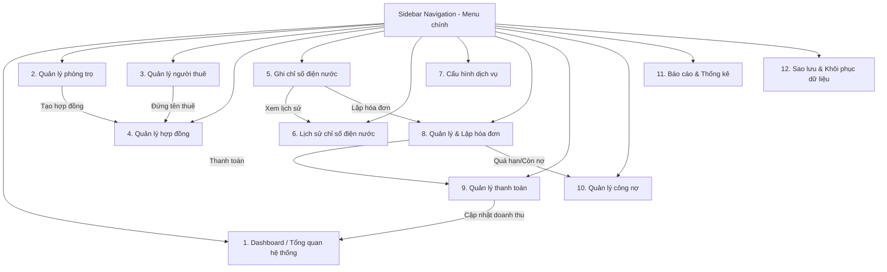

# Tài Liệu Thiết Kế Danh Sách Màn Hình - Dự Án RoomMate PMS

Tài liệu này mô tả chi tiết thiết kế danh sách 12 màn hình (UI Screens) trong hệ thống **RoomMate PMS (Hệ thống quản lý nhà trọ, điện nước và hóa đơn)**.

Ứng dụng được xây dựng dựa trên kiến trúc **Single Page Application (SPA)** với bộ điều hướng Hash Router (`src/router.js`), tích hợp với hệ thống lưu trữ LocalStorage, mô-đun nghiệp vụ (Business Rules), bộ kiểm thử tự động (Vitest & Playwright) và các thành phần giao diện Bootstrap 5 linh hoạt.

---

## 1. Sơ Đồ Điều Hướng Giao Diện (Navigation Diagram)

```mermaid
graph TD
    Sidebar[Sidebar Navigation - Menu chính] --> DashboardPage[1. Dashboard / Tổng quan hệ thống]
    Sidebar --> RoomsPage[2. Quản lý phòng trọ]
    Sidebar --> TenantsPage[3. Quản lý người thuê]
    Sidebar --> ContractsPage[4. Quản lý hợp đồng]
    Sidebar --> MetersPage[5. Ghi chỉ số điện nước]
    Sidebar --> MetersHistoryPage[6. Lịch sử chỉ số điện nước]
    Sidebar --> ServicesPage[7. Cấu hình dịch vụ]
    Sidebar --> InvoicesPage[8. Quản lý & Lập hóa đơn]
    Sidebar --> PaymentsPage[9. Quản lý thanh toán]
    Sidebar --> DebtsPage[10. Quản lý công nợ]
    Sidebar --> ReportsPage[11. Báo cáo & Thống kê]
    Sidebar --> BackupPage[12. Sao lưu & Khôi phục dữ liệu]

    %% Luồng liên kết nghiệp vụ chính
    RoomsPage -->|Tạo hợp đồng| ContractsPage
    TenantsPage -->|Đứng tên thuê| ContractsPage
    MetersPage -->|Xem lịch sử| MetersHistoryPage
    MetersPage -->|Lập hóa đơn| InvoicesPage
    InvoicesPage -->|Thanh toán| PaymentsPage
    InvoicesPage -->|Quá hạn/Còn nợ| DebtsPage
    PaymentsPage -->|Cập nhật doanh thu| DashboardPage
```

---

## 2. Chi Tiết Danh Sách 12 Màn Hình (Screen Specifications)

---

### 2.1. Màn Hình Dashboard (Tổng Quan Hệ Thống)
* **Đường dẫn (Route)**: `/dashboard`
* **Tệp mã nguồn**: `src/pages/dashboard-page.js`
* **Mục đích**: Cung cấp cái nhìn tổng quan về tình hình kinh doanh, số lượng phòng, người thuê, tổng doanh thu thực thu, tổng công nợ và các biểu đồ xu hướng.
* **Chức năng chính**:
  * **Thống kê nhanh (KPI Stat Cards)**:
    * `stat-total-rooms-value`: Tổng số phòng trọ.
    * `stat-available-rooms-value`: Số phòng đang trống.
    * `stat-rented-rooms-value`: Số phòng đang cho thuê.
    * `stat-maintenance-rooms-value`: Số phòng đang bảo trì.
    * `stat-total-tenants-value`: Tổng số khách thuê đang ở.
    * `stat-monthly-revenue-value`: Tổng tiền thực tế đã thu trong tháng.
    * `stat-total-debt-value`: Tổng tiền nợ chưa thu hồi.
  * **Các biểu đồ trực quan (Chart.js)**:
    * `revenue-chart-canvas`: Biểu đồ cột thể hiện xu hướng doanh thu thực thu vs công nợ theo các tháng.
    * `room-status-chart-canvas`: Biểu đồ tròn tỷ lệ phân bổ trạng thái phòng trọ.
    * `consumption-chart-canvas`: Biểu đồ tiêu thụ điện (kWh) và nước ($m^3$).
  * **Widget Cảnh báo & Công việc cần làm**:
    * Cảnh báo danh sách hợp đồng sắp hết hạn.
    * Cảnh báo danh sách hóa đơn quá hạn chưa thanh toán.

---

### 2.2. Màn Hình Quản Lý Phòng Trọ (Room Management)
* **Đường dẫn (Route)**: `/rooms`
* **Tệp mã nguồn**: `src/pages/rooms-page.js`, `src/components/room-form.js`
* **Mục đích**: Quản lý danh mục phòng trọ, tạo mới, chỉnh sửa, xóa và chuyển đổi chế độ xem.
* **Chức năng chính**:
  * **Chuyển chế độ xem**: Hỗ trợ xem dạng Thẻ (Grid Cards) hoặc dạng Bảng (Table View via `[data-testid="view-table"]`).
  * **Thêm phòng mới**: Nút `[data-testid="btn-add-room"]` mở Modal `[data-testid="room-form-modal"]`. Nhập Mã phòng (`P101`), Tên phòng, Tầng, Loại phòng, Diện tích, Giá thuê, Số người tối đa, Trạng thái.
  * **Sửa phòng**: Nút Sửa `[data-testid="btn-edit-room-${id}"]` mở modal cập nhật thông tin phòng.
  * **Xóa phòng**: Nút Xóa `[data-testid="btn-delete-room-${id}"]` xác nhận xóa phòng (nếu không có hợp đồng/hóa đơn active).
  * **Tìm kiếm & Lọc**: Tìm kiếm theo từ khóa `[data-testid="input-search-room"]`, lọc theo trạng thái (`available`, `rented`, `maintenance`), loại phòng và sắp xếp đơn giá.

---

### 2.3. Màn Hình Quản Lý Người Thuê (Tenant Management)
* **Đường dẫn (Route)**: `/tenants`
* **Tệp mã nguồn**: `src/pages/tenants-page.js`, `src/components/tenant-form.js`
* **Mục đích**: Quản lý hồ sơ cá nhân, số điện thoại, CCCD và lịch sử thuê của người ở.
* **Chức năng chính**:
  * **Thêm người thuê mới**: Nút `[data-testid="btn-add-tenant"]` mở Modal `[data-testid="tenant-form-modal"]`. Nhập Họ tên, Số điện thoại (10-11 số), CCCD (9 hoặc 12 số), Email.
  * **Chỉnh sửa thông tin**: Cập nhật SĐT, Email, hồ sơ khách thuê.
  * **Chuyển vào Lưu trữ (Archive)**: Đưa hồ sơ khách thuê đã chuyển đi vào trạng thái lưu trữ (`archived`).
  * **Xem hồ sơ & Lịch sử thuê phòng**: Mở Modal xem chi tiết quá trình ở và các hợp đồng đã từng ký.
  * **Tìm kiếm & Lọc**: Tìm theo Tên, SĐT, CCCD `[data-testid="input-search-tenant"]` và lọc theo trạng thái khách (`active`, `inactive`, `archived`).

---

### 2.4. Màn Hình Quản Lý Hợp Đồng (Contract Management)
* **Đường dẫn (Route)**: `/contracts`
* **Tệp mã nguồn**: `src/pages/contracts-page.js`
* **Mục đích**: Quản lý hợp đồng thuê phòng, kích hoạt, gia hạn, kết thúc và thanh lý hợp đồng.
* **Chức năng chính**:
  * **Tạo & Kích hoạt hợp đồng mới**: Nút `[data-testid="btn-add-contract"]`. Chọn phòng, chọn người đại diện, nhập thời hạn (Từ ngày - Đến ngày), giá thuê, tiền cọc. Kích hoạt tự động chuyển phòng sang "Đang thuê".
  * **Xem chi tiết hợp đồng**: Mở Modal `[data-testid="contract-detail-modal"]` xem chi tiết thời hạn, tiền cọc, người đại diện.
  * **Chỉnh sửa hợp đồng**: Cập nhật số tiền cọc hoặc giá thuê thỏa thuận.
  * **Gia hạn hợp đồng**: Mở Modal `[data-testid="extend-modal"]` cập nhật ngày kết thúc mới cho hợp đồng.
  * **Kết thúc / Thanh lý hợp đồng**: Kết thúc hợp đồng bình thường hoặc thanh lý sớm qua Modal `[data-testid="confirm-modal"]`, chuyển phòng về trạng thái "Trống".
  * **Kiểm tra trùng lặp**: Ràng buộc không cho phép tạo hợp đồng trùng thời gian trên cùng 1 phòng.

---

### 2.5. Màn Hình Ghi Chỉ Số Điện Nước (Utility Readings / Meters)
* **Đường dẫn (Route)**: `/meters`
* **Tệp mã nguồn**: `src/pages/meter-readings-page.js`, `src/components/meter-reading-form.js`
* **Mục đích**: Nhập chỉ số công tơ điện và nước hàng tháng trực tiếp dạng bảng tính linh hoạt.
* **Chức năng chính**:
  * **Chọn tháng/năm ghi số**: Bộ lọc `[data-testid="filter-month"]` và `[data-testid="filter-year"]`.
  * **Nhập liệu dạng Bảng**: Hiển thị danh sách tất cả các phòng đang thuê. Nhập số điện mới `[data-testid="input-elec-new-${roomId}"]` và nước mới `[data-testid="input-water-new-${roomId}"]`.
  * **Tự động tính tiêu thụ & Cảnh báo**: Tự động tính chỉ số tiêu thụ, phát hiện biến động bất thường so với tháng trước.
  * **Ràng buộc chỉ số không âm**: Hiển thị cảnh báo màu đỏ và chặn lưu nếu chỉ số điện mới hoặc nước mới mang giá trị âm (`< 0`) hoặc nhỏ hơn chỉ số cũ.
  * **Lưu tất cả**: Nút `[data-testid="btn-save-all"]` đồng bộ lưu toàn bộ dòng chỉ số điện nước.

---

### 2.6. Màn Hình Lịch Sử Chỉ Số Điện Nước (Meters History)
* **Đường dẫn (Route)**: `/meters-history`
* **Tệp mã nguồn**: `src/pages/meter-readings-history-page.js`
* **Mục đích**: Tra cứu nhật ký điện nước các tháng trước của từng phòng.
* **Chức năng chính**:
  * Xem danh sách lịch sử chỉ số cũ, chỉ số mới, mức tiêu thụ điện nước theo thời gian.
  * Lọc lịch sử chỉ số theo phòng trọ cụ thể hoặc khoảng thời gian.

---

### 2.7. Màn Hình Cấu Hình Dịch Vụ (Service Configuration)
* **Đường dẫn (Route)**: `/services`
* **Tệp mã nguồn**: `src/pages/services-page.js`, `src/components/service-config-form.js`
* **Mục đích**: Thiết lập danh mục đơn giá dịch vụ điện, nước, internet, rác, gửi xe...
* **Chức năng chính**:
  * **Thêm dịch vụ**: Nút `[data-testid="btn-add-service"]` mở Modal `[data-testid="service-config-form-modal"]`. Nhập Mã, Tên dịch vụ, Cách tính, Đơn vị, Đơn giá.
  * **Sửa đơn giá**: Cập nhật đơn giá áp dụng cho các hóa đơn lập mới từ thời điểm sửa.
  * **Tạm ngưng / Kích hoạt lại**: Chuyển trạng thái dịch vụ giữa "Đang áp dụng" và "Ngưng áp dụng".
  * **Xóa dịch vụ**: Xóa dịch vụ vĩnh viễn khỏi hệ thống qua Modal xác nhận.
  * **Tìm kiếm & Lọc**: Ô tìm kiếm `[data-testid="input-search-service"]` và lọc trạng thái `[data-testid="filter-service-status"]`.

---

### 2.8. Màn Hình Quản Lý & Lập Hóa Đơn (Invoice Management)
* **Đường dẫn (Route)**: `/invoices`
* **Tệp mã nguồn**: `src/pages/invoices-page.js`
* **Mục đích**: Lập hóa đơn hàng tháng cho phòng trọ và theo dõi tình trạng thanh toán.
* **Chức năng chính**:
  * **Lập hóa đơn tự động**: Nút `[data-testid="btn-add-invoice"]` tự động quét tiền phòng, chỉ số điện nước tiêu thụ và đơn giá dịch vụ để tạo hóa đơn.
  * **Tính toán chính xác các khoản phí**: Tự động tính tiền phòng, tiền điện tiêu thụ, tiền nước tiêu thụ, dịch vụ cộng thêm và giảm giá.
  * **Xem chi tiết hóa đơn**: Modal xem bảng tổng hợp chi tiết từng dòng phí hóa đơn.
  * **Hủy hóa đơn**: Chọn hủy hóa đơn chưa thanh toán.
  * **Tìm kiếm & Lọc**: Tìm theo tên phòng/người thuê `[data-testid="input-search-invoice"]` và lọc theo trạng thái (`unpaid`, `partial`, `paid`, `cancelled`).

---

### 2.9. Màn Hình Quản Lý Thanh Toán (Payments Management)
* **Đường dẫn (Route)**: `/payments`
* **Tệp mã nguồn**: `src/pages/payments-page.js`
* **Mục đích**: Quản lý lịch sử nộp tiền của người thuê và cập nhật công nợ hóa đơn.
* **Chức năng chính**:
  * **Ghi nhận thanh toán mới**: Nút `[data-testid="btn-add-payment"]` mở Modal `[data-testid="payment-form-modal"]`. Chọn hóa đơn, nhập số tiền đóng, chọn phương thức (`cash`, `transfer`, `e_wallet`).
  * **Thanh toán một phần / Thanh toán đủ**: Tự động tính nợ còn lại (`remainingDebt`). Khi đóng đủ tiền, hóa đơn tự động chuyển trạng thái thành "Đã thanh toán".
  * **Nhật ký phiếu thu**: Xem danh sách lịch sử phiếu thu tiền theo thời gian.
  * **Tự động đồng bộ Dashboard**: Cập nhật doanh thu thực thu và công nợ lên Dashboard.

---

### 2.10. Màn Hình Quản Lý Công Nợ (Debt Management)
* **Đường dẫn (Route)**: `/debts`
* **Tệp mã nguồn**: `src/pages/debts-page.js`
* **Mục đích**: Theo dõi danh sách phòng nợ tiền và hỗ trợ đôn đốc thu hồi nợ.
* **Chức năng chính**:
  * Danh sách tổng hợp tất cả các phòng đang có hóa đơn chưa thanh toán hoặc thanh toán thiếu.
  * Tính tổng số tiền dồn tích nợ của từng phòng.
  * Nút "Nhắc nợ nhanh": Tự động tạo mẫu tin nhắn gửi cho người thuê qua Zalo/SMS.

---

### 2.11. Màn Hình Báo Cáo & Thống Kê (Reports & Analytics)
* **Đường dẫn (Route)**: `/reports`
* **Tệp mã nguồn**: `src/pages/reports-page.js`
* **Mục đích**: Cung cấp báo cáo kinh doanh trực quan theo tháng/năm.
* **Chức năng chính**:
  * Báo cáo Doanh thu dự kiến vs Doanh thu thực thu.
  * Thống kê sản lượng tiêu thụ điện nước toàn tòa nhà.
  * Biểu đồ tỷ lệ lấp đầy phòng trọ.

---

### 2.12. Màn Hình Sao Lưu & Khôi Phục Dữ Liệu (Backup & Settings)
* **Đường dẫn (Route)**: `/backup` (hoặc `/settings`)
* **Tệp mã nguồn**: `src/pages/settings-page.js`
* **Mục đích**: Xuất dữ liệu dự phòng, khôi phục từ file JSON và quản lý cấu hình dữ liệu.
* **Chức năng chính**:
  * **Export Data**: Nút `[data-testid="btn-export-data"]` tải file `backup.json` về máy.
  * **Import Data**: Chọn file `.json` để khôi phục lại dữ liệu phòng, hợp đồng, hóa đơn.
  * **Xử lý lỗi file**: Hiển thị Error State `[data-testid="error-state-invalid-import"]` nếu chọn file sai cấu trúc.
  * **Cảnh báo ghi đè**: Hiển thị Modal nguy hiểm `[data-testid="danger-confirm-modal"]` khi chọn ghi đè toàn bộ dữ liệu hiện tại.

---

## 3. Bảng Ma Trận Các Thành Phần Giao Diện Dùng Chung (Reusable Components)

| Component Name | File Path | Mục Đích Sử Dụng | Các Màn Hình Sử Dụng |
| :--- | :--- | :--- | :--- |
| **renderLayout** | `src/components/layout.js` | Khung giao diện chính: Sidebar menu 12 trang, Topbar header, Avatar manager | Tất cả 12 màn hình |
| **openRoomForm** | `src/components/room-form.js` | Modal thêm / sửa phòng trọ | `/rooms` |
| **openTenantForm** | `src/components/tenant-form.js` | Modal thêm / sửa thông tin người thuê | `/tenants` |
| **openServiceConfigForm** | `src/components/service-config-form.js` | Modal thêm / sửa cấu hình đơn giá dịch vụ | `/services` |
| **openMeterReadingForm** | `src/components/meter-reading-form.js` | Modal ghi bổ sung chỉ số điện nước | `/meters` |
| **showConfirmDialog** | `src/components/confirm-dialog.js` | Modal xác nhận hành vi Xóa/Kết thúc/Hủy (`[data-testid="confirm-modal"]`) | `/rooms`, `/tenants`, `/contracts`, `/services`, `/invoices` |
| **showToast** | `src/components/toast.js` | Popup thông báo ngắn khi thực hiện hành động thành công/thất bại | Tất cả 12 màn hình |
| **renderPagination** | `src/components/pagination.js` | Phân trang danh sách dữ liệu dạng mảng | `/rooms`, `/tenants`, `/contracts`, `/services`, `/invoices`, `/payments` |
| **renderErrorState** | `src/components/error-state.js` | Hiển thị màn hình lỗi 404 hoặc file import sai cấu trúc | `/backup`, Trang 404 |
